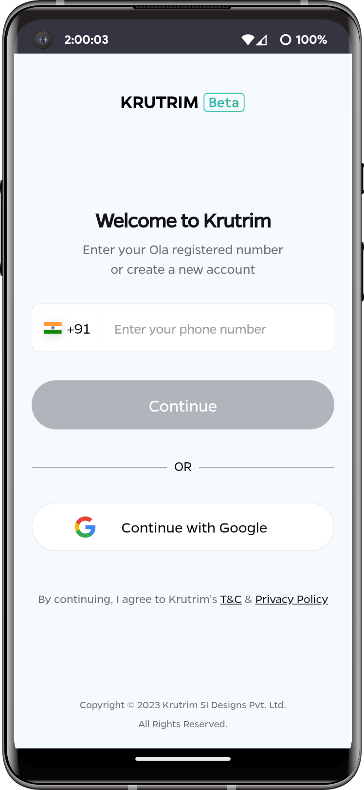

# Ola Krutrim App

## About

This (unofficial) app acts as a WebView wrapper for [chat.olakrutrim.com](https://chat.olakrutrim.com/)

## Screenshot

## Installation

Download the latest [release](https://github.com/k4ustu3h/krutrim-android-app/releases/latest) and install it on your device.
